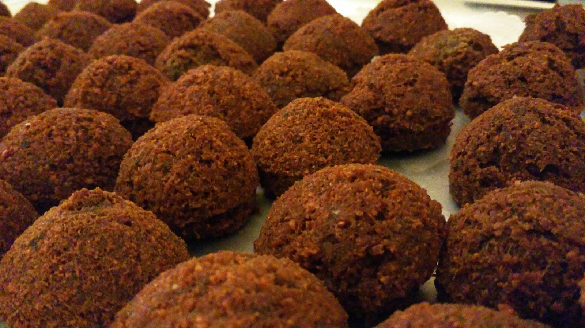
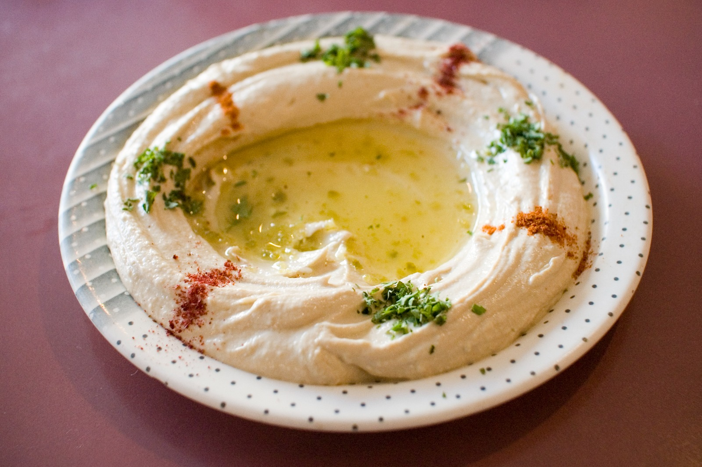

# Arabian Nights

Welcome to Arabian Nights Restaurant!

## **Snapshots**

## **Menu**

At Arabian Nights Restaurant, we offer a variety of delicious dishes made with ingredients right from the heart of the arabian house. Our menu features:

<table border='2'>
    <tr>
        <th>
            Dish Type
        </th>
        <th>
            Dish Name
        </th>
        <th>
            Price (JD)
        </th>
    </tr>
    <tr>
        <td rowspan='4'>
            Apetizers
        </td>
        <td>
            Hummus
        </td>
        <td>
            1.30
        </td>
    </tr>
    <tr>
        <td>
            Baba Ghanoush
        </td>
        <td>
            2.10
        </td>
    </tr>
    <tr>
        <td>
            Falafel
        </td>
        <td>
            1.00
        </td>
    </tr>
    <tr>
        <td>
            Sambousek
        </td>
        <td>.70</td>
    </tr>
    <tr>
        <td rowspan='4'>
            Soups and Salads
        </td>
        <td>
            Lentil Soup
        </td>
        <td>
            3.30
        </td>
    </tr>
    <tr>
        <td>
            Fattoush Salad
        </td>
        <td>
            3.10
        </td>
    </tr>
    <tr>
        <td>
            Tabouleh Salad
        </td>
        <td>
            2.00
        </td>
    </tr>
    <tr>
        <td>
            Tzatziki
        </td>
        <td>4.00</td>
    </tr>
    <tr>
        <td rowspan='5'>
            Main Course
        </td>
        <td>
            Shawarma
        </td>
        <td>
            2.80
        </td>
    </tr>
    <tr>
        <td>
            Kebabs
        </td>
        <td>
            8.60
        </td>
    </tr>
    <tr>
        <td>
            Biryani
        </td>
        <td>
            10.60
        </td>
    </tr>
    <tr>
        <td>
            Machboos
        </td>
        <td>
            9.60
        </td>
    </tr>
    <tr>
        <td>
            Mansaf
        </td>
        <td>
            15.20
        </td>
    </tr>
    <tr>
        <td rowspan='4'>
            Desserts
        </td>
        <td>
            Kunafa
        </td>
        <td>
            8.60
        </td>
    </tr>
    <tr>
        <td>
            Baklava
        </td>
        <td>
            3.30
        </td>
    </tr>
    <tr>
        <td>
            Halva
        </td>
        <td>
            2.90
        </td>
    </tr>
    <tr>
        <td>
            Umm Ali
        </td>
        <td>
            5.30
        </td>
    </tr>
</table>

## **Feedback**

Please feel free to contact me at [Hadeel Abuzayed](mailto:hadeelabuzayed01@gmail.com) for any feedback or advice.